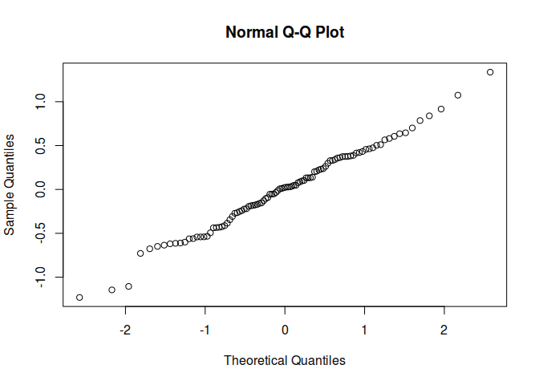

# Regression


### 1. Сгенерировать выборку из `N=100` 4-х мерных векторов из нормального закона распределения с ненулевым вектором математического ожидания и недиагональной ковариационной матрицей.

Ковариационная матрица должна генерироваться случайно перед генерацией выборки и должна удовлетворять всем свойствам ковариационной матрицы.

Define function for generating a random positive-definite matrix with user-specified positive eigenvalues. If eigenvalues are not specified, they are generated from a uniform distribution.

```r
PDmatrix <- function(n, ev = runif(n, 0, 10)) {
  Z <- matrix(ncol = n, rnorm(n^2))
  decomp <- qr(Z)
  Q <- qr.Q(decomp) 
  R <- qr.R(decomp)
  d <- diag(R)
  ph <- d / abs(d)
  O <- Q %*% diag(ph)
  Z <- t(O) %*% diag(ev) %*% O
  return(Z)
}
```

Initialize variables

```r
N <- 10 ^ 2
n <- 4
mu <- runif(n, 0, 100)
sigma <- PDmatrix(n)

print(mu)
```

```
## [1] 51.99740 87.85639 78.26254 39.37625
```

```r
print(sigma)
```

```
##            [,1]       [,2]       [,3]       [,4]
## [1,]  2.3710268  2.3901167 -0.1328229 -0.3910742
## [2,]  2.3901167  3.3277859 -1.9381787  0.4359022
## [3,] -0.1328229 -1.9381787  5.8087051  0.4884068
## [4,] -0.3910742  0.4359022  0.4884068  8.9920110
```


Generate multidimensional sample with init values

```r
library(MASS)
sample <- data.frame(mvrnorm(N, mu, sigma))

head(sample)
```

```
##         X1       X2       X3       X4
## 1 54.28216 90.26420 76.56374 36.24275
## 2 53.29668 89.12987 75.25699 38.47263
## 3 50.56658 86.13985 78.20630 44.82019
## 4 51.40126 88.47566 74.83745 37.81826
## 5 52.58883 88.02580 79.14995 38.89509
## 6 50.47555 86.82034 79.47252 37.30572
```

Затем, считая первые компоненты элементов сгенерированной выборки зависимыми переменными, а остальные компоненты -- независимыми в модели линейной регрессии, найти оценки коэффициентов регрессии и дисперсии случайных ошибок. 

```r
regr <- with(sample, {lm(X1 ~ X2 + X3 + X4)})

print(regr)
```

```
## 
## Call:
## lm(formula = X1 ~ X2 + X3 + X4)
## 
## Coefficients:
## (Intercept)           X2           X3           X4  
##   -49.56330      0.90696      0.32754     -0.09621
```

```r
head(regr$residuals)
```

```
##          1          2          3          4          5          6 
##  0.3884930  1.0743570  0.7007425 -0.1532545  0.1333811 -1.1451717
```

```r
print(var(summary(regr)$coefficients[2,]))
```

```
## [1] 222.4148
```

Проверить остатки модели на нормальность.

```r
shapiro.test(regr$residuals)
```

```
## 
## 	Shapiro-Wilk normality test
## 
## data:  regr$residuals
## W = 0.99174, p-value = 0.8021
```

```r
qqnorm(regr$residuals)
```

 

Найти истинные значения коэффициентов регрессии (см. лабораторную работу 2) и сравнить их с полученными оценками.
