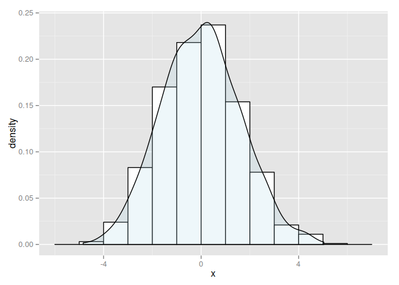
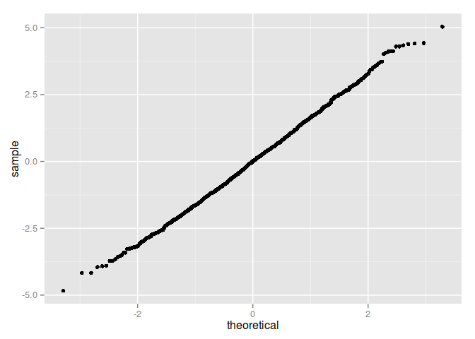
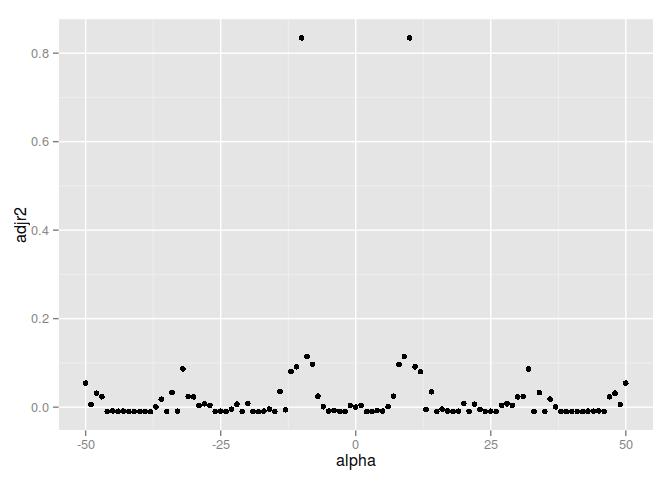
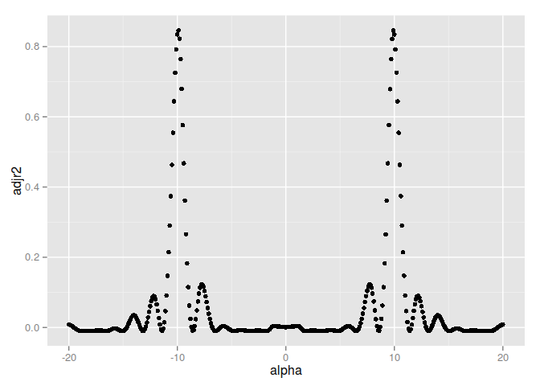
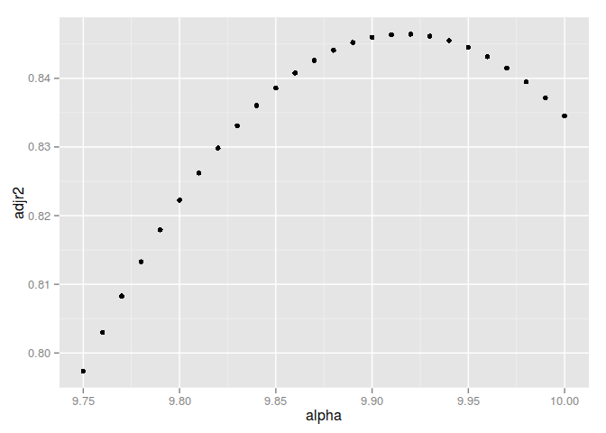
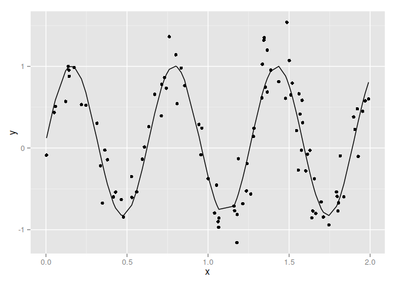

# Регрессионный Анализ


```r
library(ggplot2)
set.seed(1234)
```


## Нормальная регрессия

Сгенерировать выборку из `N = 100` `4`-х мерных векторов из нормального закона распределения с ненулевым вектором математического ожидания и недиагональной ковариационной матрицей. Ковариационная матрица должна генерироваться случайно перед генерацией выборки и должна удовлетворять всем свойствам ковариационной матрицы. Затем, считая первые компоненты элементов сгенерированной выборки зависимыми переменными, а остальные компоненты -- независимыми в модели линейной регрессии, найти оценки коэффициентов регрессии и дисперсии случайных ошибок. Проверить остатки модели на нормальность. Найти истинные значения коэффициентов регрессии (см. лабораторную работу 2) и сравнить их с полученными оценками.

### Инициализируем случайным образом параметры нормального распределения и генерируем выборку.


```r
PDmatrix <- function(n, ev = runif(n, 0, 10)) {
  Z <- matrix(ncol = n, rnorm(n ^ 2))
  decomp <- qr(Z)
  Q <- qr.Q(decomp)
  R <- qr.R(decomp)
  d <- diag(R)
  ph <- d / abs(d)
  O <- Q %*% diag(ph)
  Z <- t(O) %*% diag(ev) %*% O
  return(Z)
}
```

Генерируем выборку из `N = 100` `4`-х мерных векторов из нормального закона распределения с ненулевым вектором математического ожидания и недиагональной ковариационной матрицей.

```r
N <- 10 ^ 3
n <- 4
mu <- runif(n, 0, 10)
sigma <- PDmatrix(n)

print(mu)
```

```
## [1] 1.137034 6.222994 6.092747 6.233794
```

```r
print(sigma)
```

```
##            [,1]       [,2]       [,3]      [,4]
## [1,]  2.8800501 -1.1020784  0.1295202 -1.100834
## [2,] -1.1020784  6.2983903 -0.8549934  2.784841
## [3,]  0.1295202 -0.8549934  7.7124092  2.501735
## [4,] -1.1008343  2.7848409  2.5017355  5.704757
```


```r
require(MASS)
```

```
## Loading required package: MASS
```

```r
X <- mvrnorm(n = N, mu = mu, Sigma = sigma)
X = as.data.frame(X)
colnames(X) <- c('x1', 'x2', 'x3', 'x4')
head(X)
```

```
##            x1       x2       x3        x4
## 1  3.32664738 5.868819 5.432579  6.930223
## 2 -0.02034241 7.814550 4.938564  8.255633
## 3  0.46750680 7.546387 7.103694  6.418837
## 4  5.44237541 8.372894 3.876748  5.674416
## 5 -1.48426943 7.738315 6.807258  7.276310
## 6  1.28277426 8.384679 7.443312 10.517066
```

### Оценка коэффициенты регрессии

Подгоняем модель.

```r
model <- lm(x1 ~ x2 + x3 + x4, data = X)
summary(model)
```

```
## 
## Call:
## lm(formula = x1 ~ x2 + x3 + x4, data = X)
## 
## Residuals:
##     Min      1Q  Median      3Q     Max 
## -4.8361 -1.1395  0.0053  1.0684  5.0353 
## 
## Coefficients:
##             Estimate Std. Error t value Pr(>|t|)    
## (Intercept)  2.54252    0.19131  13.290  < 2e-16 ***
## x2          -0.07161    0.02453  -2.919  0.00359 ** 
## x3           0.05347    0.02197   2.434  0.01513 *  
## x4          -0.19939    0.02774  -7.187 1.29e-12 ***
## ---
## Signif. codes:  0 '***' 0.001 '**' 0.01 '*' 0.05 '.' 0.1 ' ' 1
## 
## Residual standard error: 1.618 on 996 degrees of freedom
## Multiple R-squared:  0.1102,	Adjusted R-squared:  0.1075 
## F-statistic: 41.11 on 3 and 996 DF,  p-value: < 2.2e-16
```


```r
coef <- coefficients(model)
resid <- residuals(model)

residvar <- var(resid)
residmean <- coef[1]
residvar
```

```
## [1] 2.610237
```

```r
residmean
```

```
## (Intercept) 
##    2.542518
```

### Проверка на нормальность


```r
shapiro.test(resid)
```

```
## 
## 	Shapiro-Wilk normality test
## 
## data:  resid
## W = 0.99835, p-value = 0.4615
```

```r
ggplot(data.frame(x = resid), aes(x)) + 
  geom_histogram(binwidth = 1, aes(y = ..density..), colour = "black", fill = "white") + 
  geom_density(alpha = .2, fill = "lightblue")
```

 

```r
ggplot(data.frame(x = resid), aes(sample = x)) + stat_qq()
```

 

Остатки распределены нормально.

### Истинные значения коэффициентов регрессии

По формулам из лабораторной работы 2, то есть:

$\mu_{1.2} = \mu_{(1)} + \Sigma_{(12)}\Sigma^{-1}_{(22)} (x_{(2)} - \mu_{(2)})$

Тогда нам нужно подтвердить близость следующих значений:

* $\mu_{(1)} + \Sigma_{(12)}\Sigma^{-1}_{(22)}\mu_{(2)}$ и коэффициент при `Intercept`;
* $\Sigma_{(12)}\Sigma^{-1}_{(22)}$ и коэффициентов при `x1`-`x3`.


```r
print(mu[1] - sigma[1,2:n] %*% solve(sigma[2:n,2:n]) %*% mu[2:n])
```

```
##          [,1]
## [1,] 2.396975
```

```r
print(residmean)
```

```
## (Intercept) 
##    2.542518
```

```r
print(sigma[1,2:n] %*% solve(sigma[2:n,2:n]))
```

```
##             [,1]       [,2]       [,3]
## [1,] -0.08689121 0.06528299 -0.1791798
```

```r
print(coef[-1])
```

```
##          x2          x3          x4 
## -0.07160552  0.05347011 -0.19939236
```

## Подбор оптимальной регрессионной модели

Из файла `Lab2Task2Var[x].scv` загрузить данные. Вместо `[x]` необходимо подставить ваш номер варианта. Данные содержат как значения зависимых переменных, так и независимых. Вид зависимости известен и задан в таблице. Однако кроме коэффициентов регрессии неизвестен и коэффициент. Предложите метод оценивания всех неизвестных коэффициентов, и оцените их. Приведите графическую иллюстрацию полученных результатов.

Вариант `6` -- зависимость $y_{i} = \beta_{0} + \beta_{1} \sin{\alpha x_{i}} + \varepsilon_{i}$


```r
data2 <- read.csv(file = "data/Lab2Task2Var6.csv")
head(data2)
```

```
##   X         x          y
## 1 1 1.3655427  0.6851769
## 2 2 1.5677628  0.4142338
## 3 3 1.0619084 -0.9011985
## 4 4 1.0527688 -0.4536485
## 5 5 0.4782552 -0.8463048
## 6 6 1.3865156  0.9528049
```

```r
data2$X <- NULL
head(data2)
```

```
##           x          y
## 1 1.3655427  0.6851769
## 2 1.5677628  0.4142338
## 3 1.0619084 -0.9011985
## 4 1.0527688 -0.4536485
## 5 0.4782552 -0.8463048
## 6 1.3865156  0.9528049
```

Будем оценивать неизвестные коэффициенты при помощи модели линейной регрессии, а параметр $\alpha$ -- на некотором дискретном множестве доступных значений.
Поскольку $\alpha$ -- детерминированная величина, то на каждом шаге эксперимента просто ко всему вектору $x$ будем ее добавлять.
Критерием качества будем считать величину Adjusted R-squared, чем эта величина больше, тем лучше.


```r
alpha.seq <- seq(from = -50, to = 50, by = 1)

regr.with.alpha <- function(alpha.seq) {
    # Pre-allocate data frame space with proper data types
    df.len <- length(alpha.seq)
    df <- data.frame(beta.0 = numeric(df.len), beta.1 = numeric(df.len), pval = numeric(df.len), adjr2 = numeric(df.len))
    
    for (i in 1:df.len) {
      if (alpha.seq[i] != 0) {
        experdata2 <- data.frame(x = data2$x * alpha.seq[i],y = data2$y)
        model <- lm(formula = y ~ 1 + sin(x), data = experdata2)
        df$beta.0[i] <- model$coefficients[[1]]
        df$beta.1[i] <- model$coefficients[[2]]
        sum.mod <- summary(model)
        df$pval[i] <- pf(sum.mod$fstatistic[1], sum.mod$fstatistic[2], sum.mod$fstatistic[3], lower.tail = FALSE)
        df$adjr2[i] <- sum.mod$adj.r.squared
      }
    }
    
    df$alpha <- alpha.seq
    
    return(df)
}

resultingdf <- regr.with.alpha(alpha.seq = alpha.seq)

head(resultingdf)
```

```
##       beta.0       beta.1       pval        adjr2 alpha
## 1 0.09931585  0.239578300 0.01121123  0.054280486   -50
## 2 0.11028547  0.120103104 0.20971552  0.005966757   -49
## 3 0.09706178 -0.201070930 0.04261798  0.031498453   -48
## 4 0.09778424 -0.176662274 0.06916960  0.023440587   -47
## 5 0.10280038  0.001266301 0.99015822 -0.010202505   -46
## 6 0.10027929  0.038777817 0.68067919 -0.008450855   -45
```

```r
ggplot(resultingdf, aes(x = alpha, y = adjr2)) + geom_point()
```

 

Отсюда видно, что $\alpha \in (-20,20)$. В этом диапазоне проведем такой же эксперимент с уменьшенным шагом изменения $\alpha$.


```r
alpha.seq2 <- seq(from = -20, to = 20, by = .1)

resultingdf2 <- regr.with.alpha(alpha.seq = alpha.seq2)

head(resultingdf2)
```

```
##       beta.0      beta.1      pval         adjr2 alpha
## 1 0.08694287 -0.12489535 0.1800830  0.0082432181 -20.0
## 2 0.08920279 -0.12058983 0.1943299  0.0070986994 -19.9
## 3 0.09164168 -0.11518171 0.2163564  0.0055077395 -19.8
## 4 0.09413443 -0.10859437 0.2473278  0.0035675004 -19.7
## 5 0.09655400 -0.10068580 0.2887953  0.0013872650 -19.6
## 6 0.09877045 -0.09132444 0.3423766 -0.0009066644 -19.5
```

```r
ggplot(resultingdf2, aes(x = alpha, y = adjr2)) + geom_point()
```

 

Теперь $\alpha \in (9.75,10)$. Уменьшим шаг последний раз:


```r
alpha.seq3 <- seq(from = 9.75, to = 10, by = 0.01)

resultingdf3 <- regr.with.alpha(alpha.seq = alpha.seq3)

resultingdf3
```

```
##        beta.0    beta.1         pval     adjr2 alpha
## 1  0.09937030 0.8983456 5.885028e-36 0.7973267  9.75
## 2  0.09886287 0.9015405 1.469236e-36 0.8029722  9.76
## 3  0.09834369 0.9044841 3.829399e-37 0.8082929  9.77
## 4  0.09781332 0.9071743 1.048556e-37 0.8132829  9.78
## 5  0.09727235 0.9096091 3.035780e-38 0.8179367  9.79
## 6  0.09672141 0.9117872 9.354064e-39 0.8222495  9.80
## 7  0.09616111 0.9137077 3.087598e-39 0.8262170  9.81
## 8  0.09559211 0.9153698 1.098842e-39 0.8298355  9.82
## 9  0.09501508 0.9167734 4.242970e-40 0.8331017  9.83
## 10 0.09443071 0.9179187 1.788242e-40 0.8360133  9.84
## 11 0.09383970 0.9188061 8.272440e-41 0.8385681  9.85
## 12 0.09324274 0.9194368 4.221831e-41 0.8407650  9.86
## 13 0.09264057 0.9198120 2.387647e-41 0.8426031  9.87
## 14 0.09203390 0.9199335 1.502013e-41 0.8440822  9.88
## 15 0.09142347 0.9198032 1.054138e-41 0.8452028  9.89
## 16 0.09081001 0.9194236 8.270820e-42 0.8459659  9.90
## 17 0.09019426 0.9187975 7.263349e-42 0.8463729  9.91
## 18 0.08957695 0.9179280 7.141038e-42 0.8464261  9.92
## 19 0.08895880 0.9168185 7.854331e-42 0.8461279  9.93
## 20 0.08834056 0.9154725 9.648632e-42 0.8454816  9.94
## 21 0.08772293 0.9138942 1.320485e-41 0.8444908  9.95
## 22 0.08710663 0.9120877 2.006595e-41 0.8431596  9.96
## 23 0.08649236 0.9100575 3.371893e-41 0.8414925  9.97
## 24 0.08588081 0.9078084 6.236311e-41 0.8394945  9.98
## 25 0.08527267 0.9053452 1.262822e-40 0.8371712  9.99
## 26 0.08466858 0.9026730 2.783900e-40 0.8345281 10.00
```

```r
ggplot(resultingdf3, aes(x = alpha, y = adjr2)) + geom_point()
```

 

Считаем $\alpha = 0.92$, $\hat{\beta}_{0} = 0.0895$, $\hat{\beta}_{1} = 0.917$.


```r
fitted <- sapply(data2$x, function(i) 0.0895 + 0.917*sin(9.92*i))

ggplot(data2, aes(x,y)) + geom_point() + geom_line(data=data.frame(x=data2$x, y=fitted), aes(x,y))
```

 


## Подбор регрессионной модели

Из файла `Lab2Task3Var[x].scv` загрузить данные. Вместо `[x]` необходимо подставить ваш номер варианта. Данные содержат как значения зависимых переменных, так и независимых в модели множественной линейной регрессии. Найти оценки коэффициентов регрессии, определить какие из них статистически значимые, а какие нет. Обратите внимание, что в значениях `y` есть пропуски. Кроме этого провести "пошаговую оценку коэффициентов регрессии" как с добавлением переменных, так и с удалением. Выберете на ваш взгляд наиболее адекватную модель (если модели получились различные) и спрогнозируйте те значения `y`, которые были пропущены.

Вариант `6`.


```r
data3 <- read.csv(file = "data/Lab3Task3Var6.csv")
head(data3)
```

```
##   X         y       x.1       x.2      x.3      x.4       x.5      x.6
## 1 1 303.10208 33.414110 43.999563 37.78657 29.32568 31.876859 26.07701
## 2 2 135.98407 83.816275 22.241871 32.52388 53.96245 78.447623 42.17348
## 3 3  94.51858  3.906791  8.054924 76.19034 54.35912  2.373181 93.98127
## 4 4 333.50656 32.969035 30.809450 57.93534 27.53592 98.500559 72.76227
## 5 5 500.79861 93.817223 72.024854 97.97387 53.93213 89.145543 46.34371
## 6 6 291.03894 33.473556 89.262420 28.48112 85.99810 67.644762 43.06549
##         x.7       x.8      x.9      x.10
## 1 56.240055  3.327830 99.06299 48.076115
## 2  2.116319 25.280299 30.65695 59.011546
## 3 21.342368  4.438407 59.80991 12.552126
## 4 78.130683 79.632874 68.77228  6.354355
## 5 83.761154 96.645648 21.67026 86.593983
## 6  7.776277 82.874000 24.95325 64.930406
```

```r
data3$X <- NULL
head(data3)
```

```
##           y       x.1       x.2      x.3      x.4       x.5      x.6
## 1 303.10208 33.414110 43.999563 37.78657 29.32568 31.876859 26.07701
## 2 135.98407 83.816275 22.241871 32.52388 53.96245 78.447623 42.17348
## 3  94.51858  3.906791  8.054924 76.19034 54.35912  2.373181 93.98127
## 4 333.50656 32.969035 30.809450 57.93534 27.53592 98.500559 72.76227
## 5 500.79861 93.817223 72.024854 97.97387 53.93213 89.145543 46.34371
## 6 291.03894 33.473556 89.262420 28.48112 85.99810 67.644762 43.06549
##         x.7       x.8      x.9      x.10
## 1 56.240055  3.327830 99.06299 48.076115
## 2  2.116319 25.280299 30.65695 59.011546
## 3 21.342368  4.438407 59.80991 12.552126
## 4 78.130683 79.632874 68.77228  6.354355
## 5 83.761154 96.645648 21.67026 86.593983
## 6  7.776277 82.874000 24.95325 64.930406
```

```r
length(data3$y)
```

```
## [1] 100
```

```r
sum(complete.cases(data3))
```

```
## [1] 100
```

```r
length(data3$y) == sum(complete.cases(data3))
```

```
## [1] TRUE
```

Пропусков в данных нету. Для перестраховки:


```r
data3.compl <- data3[complete.cases(data3), ]
data3.incompl <- data3[!complete.cases(data3), ]
```


```r
model <- lm(formula = y ~ ., data = data3.compl)
summary(model)
```

```
## 
## Call:
## lm(formula = y ~ ., data = data3.compl)
## 
## Residuals:
##     Min      1Q  Median      3Q     Max 
## -4.1134 -1.0860 -0.1075  1.3239  3.2754 
## 
## Coefficients:
##              Estimate Std. Error t value Pr(>|t|)    
## (Intercept) -0.009614   0.911159  -0.011    0.992    
## x.1          0.727741   0.005904 123.268   <2e-16 ***
## x.2          2.572362   0.005964 431.315   <2e-16 ***
## x.3         -0.003619   0.006125  -0.591    0.556    
## x.4          0.184157   0.006362  28.947   <2e-16 ***
## x.5          0.006220   0.005695   1.092    0.278    
## x.6          0.001929   0.006275   0.307    0.759    
## x.7          2.863945   0.006388 448.333   <2e-16 ***
## x.8         -0.001876   0.006573  -0.285    0.776    
## x.9          0.003128   0.006074   0.515    0.608    
## x.10        -0.012224   0.006715  -1.820    0.072 .  
## ---
## Signif. codes:  0 '***' 0.001 '**' 0.01 '*' 0.05 '.' 0.1 ' ' 1
## 
## Residual standard error: 1.68 on 89 degrees of freedom
## Multiple R-squared:  0.9998,	Adjusted R-squared:  0.9998 
## F-statistic: 5.536e+04 on 10 and 89 DF,  p-value: < 2.2e-16
```

Можно сделать вывод, что значимыми в модели являются переменные `x1`, `x2`, `x4`, `x7`. Переменная `x10` остаётся под вопросом.

Проведем пошаговую оценку.


```r
step <- stepAIC(model, direction = "both")
```

```
## Start:  AIC=114.15
## y ~ x.1 + x.2 + x.3 + x.4 + x.5 + x.6 + x.7 + x.8 + x.9 + x.10
## 
##        Df Sum of Sq    RSS    AIC
## - x.8   1         0    252 112.24
## - x.6   1         0    252 112.25
## - x.9   1         1    252 112.44
## - x.3   1         1    252 112.54
## - x.5   1         3    255 113.48
## <none>                 251 114.15
## - x.10  1         9    261 115.80
## - x.4   1      2366   2617 346.47
## - x.1   1     42904  43155 626.74
## - x.2   1    525271 525523 876.70
## - x.7   1    567539 567790 884.43
## 
## Step:  AIC=112.24
## y ~ x.1 + x.2 + x.3 + x.4 + x.5 + x.6 + x.7 + x.9 + x.10
## 
##        Df Sum of Sq    RSS    AIC
## - x.6   1         0    252 110.37
## - x.9   1         1    252 110.53
## - x.3   1         1    253 110.65
## - x.5   1         3    255 111.51
## <none>                 252 112.24
## + x.8   1         0    251 114.15
## - x.10  1        10    262 114.28
## - x.4   1      2389   2640 345.34
## - x.1   1     43456  43708 626.01
## - x.2   1    529850 530101 875.57
## - x.7   1    574676 574928 883.68
## 
## Step:  AIC=110.37
## y ~ x.1 + x.2 + x.3 + x.4 + x.5 + x.7 + x.9 + x.10
## 
##        Df Sum of Sq    RSS    AIC
## - x.9   1         1    253 108.69
## - x.3   1         1    253 108.78
## - x.5   1         3    255 109.72
## <none>                 252 110.37
## + x.6   1         0    252 112.24
## + x.8   1         0    252 112.25
## - x.10  1        10    262 112.45
## - x.4   1      2536   2788 348.78
## - x.1   1     44226  44478 625.76
## - x.2   1    546118 546370 876.59
## - x.7   1    605712 605964 886.94
## 
## Step:  AIC=108.69
## y ~ x.1 + x.2 + x.3 + x.4 + x.5 + x.7 + x.10
## 
##        Df Sum of Sq    RSS    AIC
## - x.3   1         1    254 107.13
## - x.5   1         4    256 108.18
## <none>                 253 108.69
## + x.9   1         1    252 110.37
## + x.6   1         0    252 110.53
## + x.8   1         0    252 110.58
## - x.10  1        11    264 111.04
## - x.4   1      2609   2862 349.41
## - x.1   1     44352  44604 624.04
## - x.2   1    548815 549067 875.08
## - x.7   1    606269 606522 885.03
## 
## Step:  AIC=107.13
## y ~ x.1 + x.2 + x.4 + x.5 + x.7 + x.10
## 
##        Df Sum of Sq    RSS    AIC
## - x.5   1         4    257 106.52
## <none>                 254 107.13
## + x.3   1         1    253 108.69
## + x.9   1         1    253 108.78
## + x.6   1         0    253 108.96
## + x.8   1         0    253 108.99
## - x.10  1        10    264 109.16
## - x.4   1      2634   2888 348.31
## - x.1   1     45611  45865 624.83
## - x.2   1    549047 549301 873.12
## - x.7   1    618247 618501 884.99
## 
## Step:  AIC=106.52
## y ~ x.1 + x.2 + x.4 + x.7 + x.10
## 
##        Df Sum of Sq    RSS    AIC
## <none>                 257 106.52
## + x.5   1         4    254 107.13
## + x.9   1         1    256 108.04
## + x.3   1         1    256 108.18
## + x.6   1         1    257 108.27
## - x.10  1        10    267 108.32
## + x.8   1         0    257 108.45
## - x.4   1      2739   2996 350.00
## - x.1   1     45618  45875 622.85
## - x.2   1    549196 549454 871.15
## - x.7   1    620731 620988 883.39
```

```r
step$anova
```

```
## Stepwise Model Path 
## Analysis of Deviance Table
## 
## Initial Model:
## y ~ x.1 + x.2 + x.3 + x.4 + x.5 + x.6 + x.7 + x.8 + x.9 + x.10
## 
## Final Model:
## y ~ x.1 + x.2 + x.4 + x.7 + x.10
## 
## 
##    Step Df  Deviance Resid. Df Resid. Dev      AIC
## 1                           89   251.2955 114.1459
## 2 - x.8  1 0.2299680        90   251.5255 112.2374
## 3 - x.6  1 0.3283508        91   251.8538 110.3679
## 4 - x.9  1 0.8111674        92   252.6650 108.6894
## 5 - x.3  1 1.1075951        93   253.7726 107.1268
## 6 - x.5  1 3.5566345        94   257.3292 106.5186
```

Проверим нужно ли включать `x10`:


```r
model <- lm(formula = y ~ x.1 + x.2 + x.4 + x.7 + x.10 - 1, data = data3.compl)
summary(model)
```

```
## 
## Call:
## lm(formula = y ~ x.1 + x.2 + x.4 + x.7 + x.10 - 1, data = data3.compl)
## 
## Residuals:
##     Min      1Q  Median      3Q     Max 
## -3.9992 -1.2452  0.0703  1.3752  3.6970 
## 
## Coefficients:
##       Estimate Std. Error t value Pr(>|t|)    
## x.1   0.729074   0.004759 153.205   <2e-16 ***
## x.2   2.573292   0.005478 469.774   <2e-16 ***
## x.4   0.185209   0.005163  35.869   <2e-16 ***
## x.7   2.864356   0.005543 516.720   <2e-16 ***
## x.10 -0.011277   0.006041  -1.867    0.065 .  
## ---
## Signif. codes:  0 '***' 0.001 '**' 0.01 '*' 0.05 '.' 0.1 ' ' 1
## 
## Residual standard error: 1.648 on 95 degrees of freedom
## Multiple R-squared:      1,	Adjusted R-squared:      1 
## F-statistic: 8.28e+05 on 5 and 95 DF,  p-value: < 2.2e-16
```

```r
summary(lm(formula = y ~ x.1 + x.2 + x.4 + x.7 - 1, data = data3.compl))
```

```
## 
## Call:
## lm(formula = y ~ x.1 + x.2 + x.4 + x.7 - 1, data = data3.compl)
## 
## Residuals:
##     Min      1Q  Median      3Q     Max 
## -3.7704 -1.1598  0.0587  1.3119  3.9252 
## 
## Coefficients:
##     Estimate Std. Error t value Pr(>|t|)    
## x.1 0.728981   0.004820   151.2   <2e-16 ***
## x.2 2.570204   0.005289   485.9   <2e-16 ***
## x.4 0.181313   0.004784    37.9   <2e-16 ***
## x.7 2.860637   0.005239   546.0   <2e-16 ***
## ---
## Signif. codes:  0 '***' 0.001 '**' 0.01 '*' 0.05 '.' 0.1 ' ' 1
## 
## Residual standard error: 1.669 on 96 degrees of freedom
## Multiple R-squared:      1,	Adjusted R-squared:      1 
## F-statistic: 1.009e+06 on 4 and 96 DF,  p-value: < 2.2e-16
```
Итого: модель имеет вид `y ~x.1 + x.2 + x.4 + x.7 - 1`. Делаем прогноз:


```r
predict(model, newdata = data3.incompl)
```

```
## numeric(0)
```

